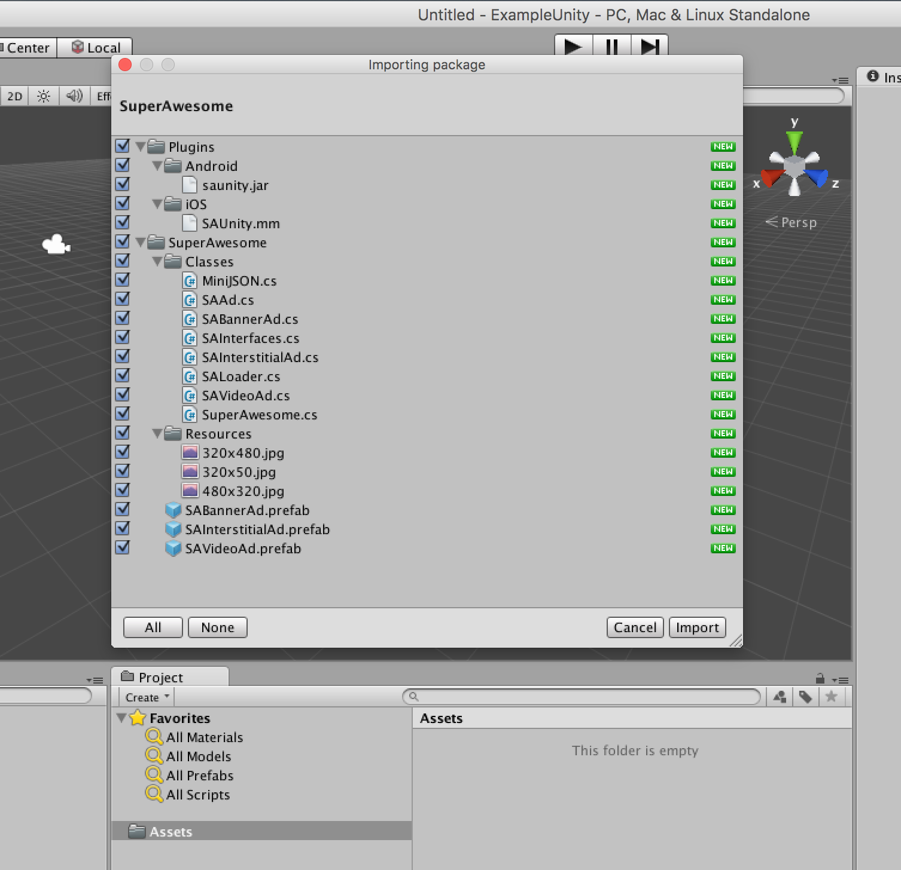
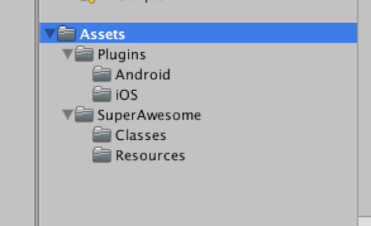
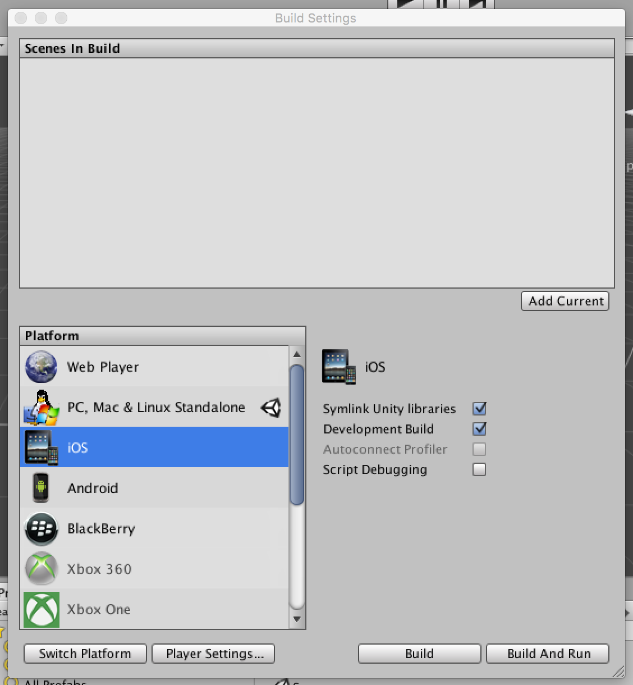
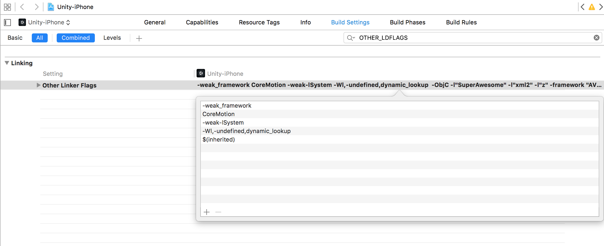
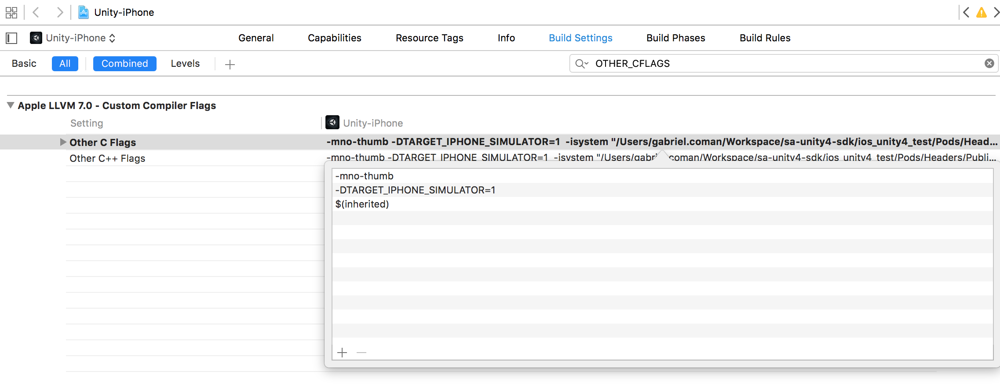
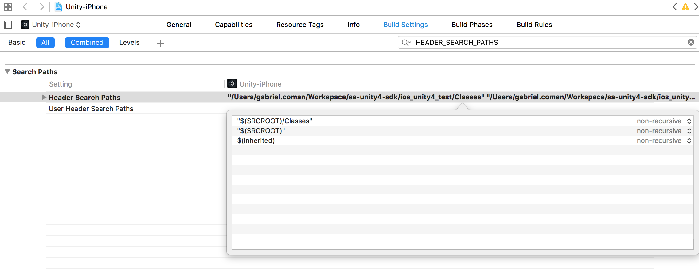
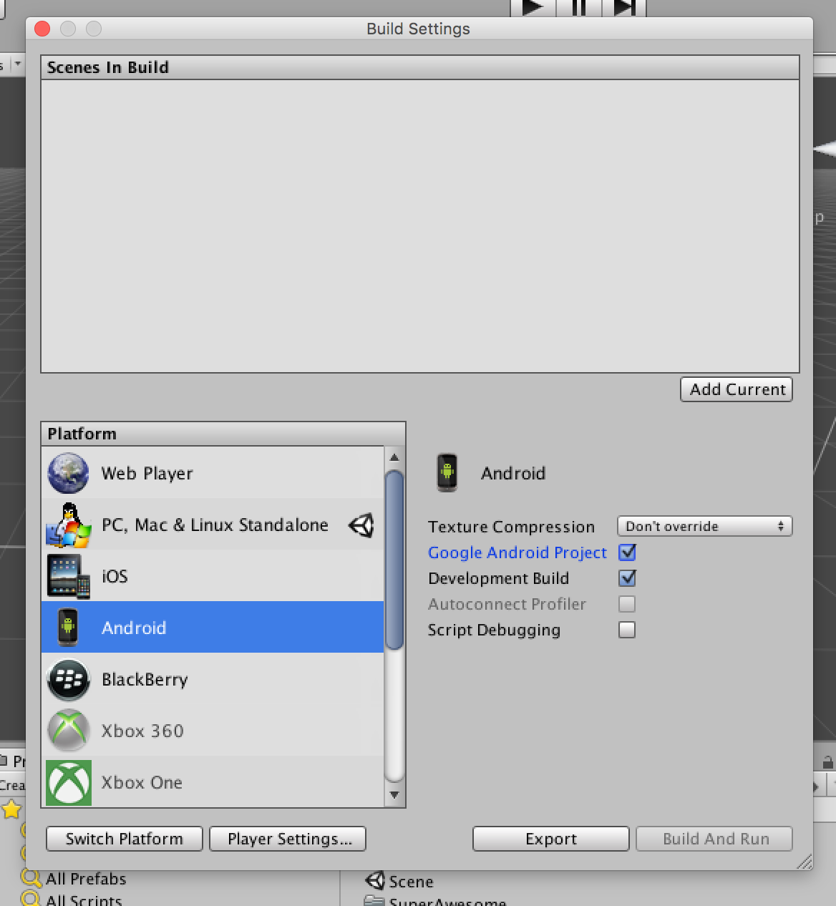
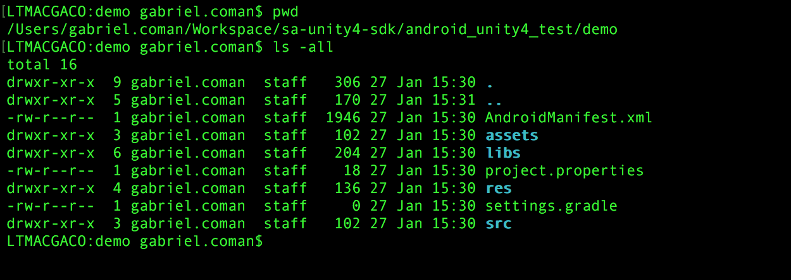
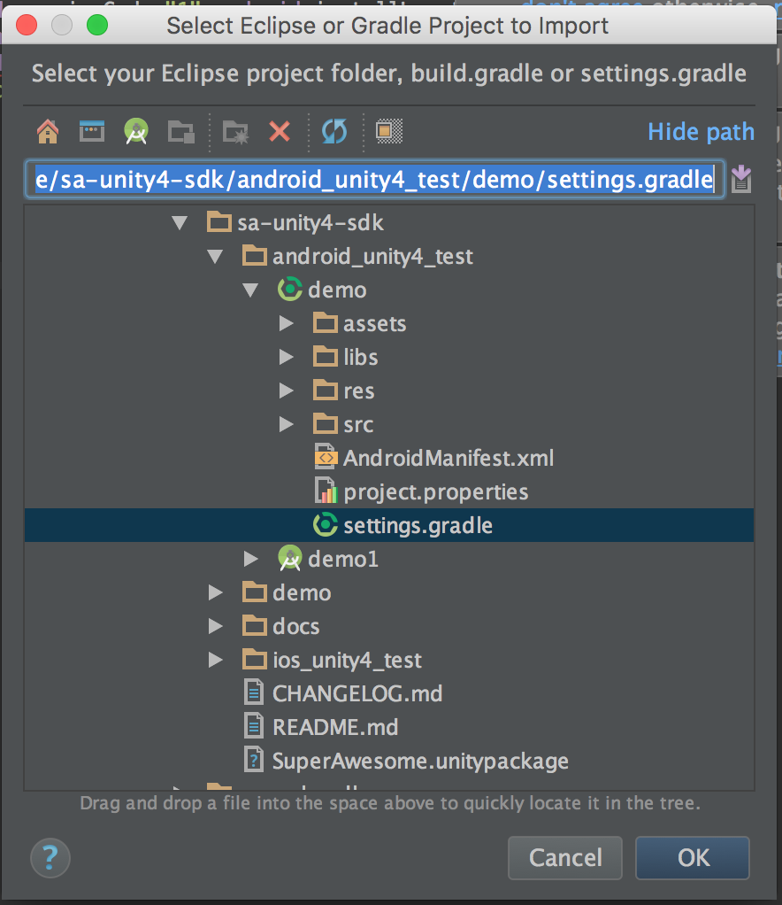
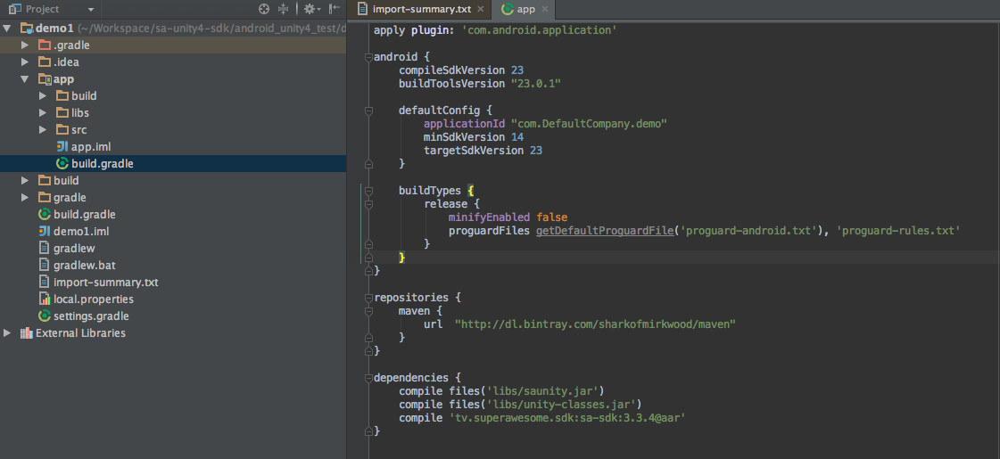

Integrate the SDK
=================

The SuperAwesome Unity SDK, as of version 3.0.8, is built with extensions to iOS / Android in order to work together
with the SuperAwesome Android or iOS SDK.
This in turn allows you to harness the full power of native components, such as video based on AVFoundation / VideoView technology,
proper WebViews, better fullscreen experience, etc.

**Note:** This document assumes:

* a Unity 4 / 5 Project named **UnityDemo**,
* containing a single scene, called **MainScene**, with a camera linked to
* a single C# file, called **MainScript.as**, that acts as main class.

Integrate the Unity SDK
^^^^^^^^^^^^^^^^^^^^^^^

To integrate the base Unity SDK into your app, first download the
`SuperAwesome-<sdk_version_unity>.unitypackage <https://github.com/SuperAwesomeLTD/sa-unity-sdk-docs/raw/master/source/res/SuperAwesome-<sdk_version_unity>.unitypackage>`_
file and import it into your Unity project as a custom assets package.

You should see an image similar to this:

Select all the files, and click Import.
If all goes well you should have a series of new folders and files in your Assets directory.

As mentioned, the Unity SDK is essentially a thin layer of classes, functions and plugins used to communicate with the iOS or Android native SDKs.
These two, depending on the case, will handle all the heavy lifting when it comes to actually loading ad data.
Rendering ads on screen falls also on the native SDKs for all three types of ads supported:

* Banner Ads
* Fullscreen or Interstitial Ads
* Preroll or Video Ads

This is so that your games or apps have the best support for rich media or third party tags.
In order to complete the SDK integration, skip to either the iOS or Android section of this documentation.

Add iOS dependencies
^^^^^^^^^^^^^^^^^^^^

To complete integrating the SDK for iOS, you'll need to follow the next steps (once):

Build the project for iOS
-------------------------

To do this, click on **File > Build Settings** menu.
There, select the **iOS** option and check the **Symlink Unity Libraries** and **Development build** options.
Then, click on **Build** and save the new XCode project on your drive.

Add the SuperAwesome iOS SDK via CocoaPods
------------------------------------------

Next, you'll need to add the AwesomeAds iOS SDK by following the quick guide below:

Install CocoaPods (if you haven't already):

.. code-block:: shell

    sudo gem install cocoapods

Go to your project's directory and initialize CocoaPods:

.. code-block:: shell

    cd /project_root
    pod init

This will create a new file simply called **Podfile**. Open it and alter it to look like this:

.. code-block:: shell

    # Uncomment this line to define a global platform for your project
    platform :ios, '6.0'

    target 'Unity-iPhone' do
      pod 'SuperAwesome/Unity', '<sdk_version_ios>'
    end

Save the file and exit it. Then execute

.. code-block:: shell

    pod update

to tell CocoaPods to add the SuperAwesome iOS SDK library and Unity plugins to your project.
Don't forget to open the **.xcworkspace** file to open your project in Xcode, instead of the .xcproj file, from here on out.

Final setup
-----------

After the CocoaPod dependency has been added, you have to make some changes to the default Unity build configuration, as the CocoaPods settings need
to be propagated in the build target but won't have done so since Unity has already set these values.

In the **Build Settings** tab you will need to search for each of **OTHER_LDFLAGS**, **OTHER_CFLAGS** and **HEADER_SEARCH_PATHS**,
double-click on them, and add **$(inherited)** to the list of existing values for these settings.
You likely will have also received a message when running **pod update**, warning you to do this.

Finally, when targeting devices for iOS 9 onwards, don't forget to add, for the moment, the following key to your plist file:

.. code-block:: xml

    <dict>
    	<key>NSAllowsArbitraryLoads</key>
    	<true/>
    </dict>

to be able to load data over both HTTPS and HTTP.

Once this is done your iOS project will be ready to use and any calls to the native SDK from your Unity project will work as expected.

Add Android dependencies
^^^^^^^^^^^^^^^^^^^^^^^^

To complete integrating the SDK for Android, you'll need to follow the next steps (once):

Build the project for Android
-----------------------------

To do this, click on **File > Build Settings** menu.
There, select the **Android** option and check the **Google Android Project** and **Development build** options.
Then, click on **Build** and save the new Android project on your drive.

Create the settings file
------------------------

Then, go to your new project folder:

.. code-block:: shell

    cd /project_root

And in the root of the project create an empty file called **settings.gradle**.

Then, using Android Studio, import your Unity Android project by selecting the .gradle file you just created (and following all instructions).

Add the SuperAwesome Android SDK via Gradle
-------------------------------------------

Next, you'll need to add the AwesomeAds Android SDK by following the quick guide below.

Just include the following in your module's **build.gradle** file (usually the file under **MyApplication/app/**):

.. code-block:: shell

    repositories {
        maven {
            url  "http://dl.bintray.com/gabrielcoman/maven"
        }
    }

    dependencies {
        compile 'tv.superawesome.sdk:saunity:<sdk_version_android>'
    }

and click **Sync Task** when prompted.

Add the SuperAwesome Android SDK as a JAR library
-------------------------------------------------

If you're running an environment which does not support Gradle, then you'll need to add the SDK manually.

1) Download the following jar files:

 * `saadloader.jar <https://github.com/SuperAwesomeLTD/sa-mobile-sdk-android-docs/raw/master/source/res/saadloader.jar>`_
 * `saevents.jar <https://github.com/SuperAwesomeLTD/sa-mobile-sdk-android-docs/raw/master/source/res/saevents.jar>`_
 * `sajsonparser.jar <https://github.com/SuperAwesomeLTD/sa-mobile-sdk-android-docs/raw/master/source/res/sajsonparser.jar>`_
 * `samodelspace.jar <https://github.com/SuperAwesomeLTD/sa-mobile-sdk-android-docs/raw/master/source/res/samodelspace.jar>`_
 * `sautils.jar <https://github.com/SuperAwesomeLTD/sa-mobile-sdk-android-docs/raw/master/source/res/sautils.jar>`_
 * `savastparser.jar <https://github.com/SuperAwesomeLTD/sa-mobile-sdk-android-docs/raw/master/source/res/savastparser.jar>`_
 * `savideoplayer.jar <https://github.com/SuperAwesomeLTD/sa-mobile-sdk-android-docs/raw/master/source/res/savideoplayer.jar>`_
 * `sawebplayer.jar <https://github.com/SuperAwesomeLTD/sa-mobile-sdk-android-docs/raw/master/source/res/sawebplayer.jar>`_
 * `sa-sdk-<sdk_version_android>.jar <https://github.com/SuperAwesomeLTD/sa-mobile-sdk-android-docs/raw/master/source/res/sa-sdk-<sdk_version_android>.jar>`_

 And add them as library dependencies in your Android Studio or Eclipse project.

2) Download `saunity.jar <https://github.com/SuperAwesomeLTD/sa-mobile-sdk-android-docs/raw/master/source/res/saunity.jar>`_

Also add it as a library dependency the same as for the previous ones.

3) Download `sa-sdk-res.zip <https://github.com/SuperAwesomeLTD/sa-mobile-sdk-android-docs/raw/master/source/res/sa-sdk-res.zip>`_ and unzip it.

You'll find two folders inside:

* drawable: containing SDK PNG files; copy the PNG files inside your projects' **drawable** folder
* layout: containing SDK layout XML files; copy the XML files inside your projects' **layout** folder

4) Add the following items in your AndroidManifest file, under the Application tag:

.. code-block:: xml

    <activity android:name="tv.superawesome.sdk.views.SAFullscreenVideoAd$SAFullscreenVideoAdActivity"
              android:label="SAFullscreenVideoAd"
              android:theme="@android:style/Theme.Black.NoTitleBar.Fullscreen"></activity>

    <activity android:name="tv.superawesome.sdk.views.SAInterstitialAd$SAInterstitialAdActivity"
              android:label="SAInterstitialAd"
              android:theme="@android:style/Theme.Black.NoTitleBar.Fullscreen"
              android:configChanges="keyboardHidden|orientation|screenSize"></activity>

    <service android:name="tv.superawesome.lib.sautils.SAAsyncTask$SAAsync" android:exported="false"/>

This will register two new activities and one service for your application, all needed by the SDK.

5) At the end you'll also need to add Google Play Services as a dependency to the project, either as a JAR or through Gradle.

Final setup
-----------

Finally, no matter your approach you'll need to do a small change to your default Unity Android manifest file.
Find the line

.. code-block:: xml

    <meta-data android:name="unityplayer.ForwardNativeEventsToDalvik" android:value="false" />

and set the value to **true**.
If you don't do this then banner ads won't be clickable on Android.

Before you begin
^^^^^^^^^^^^^^^^

Please remember that in Unity, click events are not triggered at all unless there is an EventSystem UI object.
If this doesn't exist in the Hierarchy, add one from the **GameObject > UI** menu.

Also, since the Unity SDK uses the iOS / Android native SDK, testing your app in Unity won't show ads. Only by playing the app on a simulator
or device will the whole ad process be triggered.
