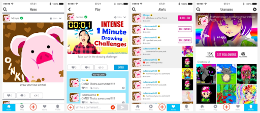

Skinning
========

Every view in the SDK supports skinning and comes with a default Skin.

The Skin itself is a standard XML layout file.
To connect the XML layout file with the actual components in code, we use the
base **ISkin** interface, out of which different types of skins are defined.

.. image:: img/021.skinning.example.png
	:width: 100%

For example the **UserView** has this default standard XML layout,
that we provide out of the box:

.. code-block:: java

    class MyUserSkin(
      override val layout: Int = R.layout.my_custom_user_skin,
      override val userIcon: Int = R.id.user_icon,
      override val userName: Int = R.id.user_name,
      override val followButton: Int = R.id.follow_button,
      override val getFollowersButton: Int = R.id.get_followers,
      override val bio: Int = R.id.user_bio,
      override val bgImage: Int = R.id.background_image,
      override val followers: Int = R.id.followers,
      override val following: Int = R.id.following,
      override val creations: Int = R.id.no_creations) : IUserSkin.Detail

This specifies basically two things:
* The XML layout file that acts as source
* The IDs of each component that is mandatory

All sub-types of **ISkin** will have a number of essential components
that are inseparable from that view.

In the above example, a **UserView** will always need to have an icon,
a user name, buttons for following or unfollowing, etc.

Since the XML layout is entirely decoupled from the View type defined in code,
any layout with any colour scheme or copy can be created.
