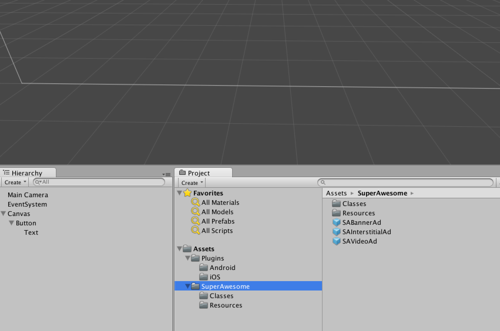
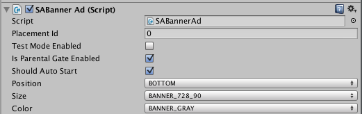
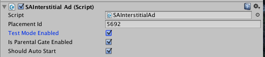

Using prefabs
=============

Once you've successfully integrated the Unity SDK (and the native iOS or Android ones), the simplest way to actually load and diplay ads in your app is through prefabs.

In the Project Explorer panel in the Unity interface, find the `Assets` folder and the `SuperAwesome` subfolder.
There you'll find three prefabs called:

* SABannerAd
* SAInterstitialAd
* SAVideoAd

Drag and drop any of then into your scene on the UI Layer.

.. image:: img/IMG_11_BanenrPrefab.png

You'll see the prefab has a default rectangular shape and has a default texture associated. Don't worry about this, it will only display in editing mode, not playing mode.

Each prefab has a number of associated parameters, that show up when you select a prefab:

* Placement id: specify the ID of the placement you want to load an ad for
* Test mode enabled: if this placement is in test mode or not
* Is parental gate enabled: if when clicking on the ad, a user will activate a Parental Gate
* Should auto start: always set to True for Prefabs
* Position: can be Top or Bottom
* Size: can be 320x50, 300x50, 728x90, 300x250
* Color: can be Transparent or Gray
* Should automatically close at end: specifies if the ad should close when it ends; should be set to true for prefabs
* Should Show Close Button: specifies if the close button should be visible

And this is the availability of different parameters per type of prefab:

=================================== ========================== ========================== ==========================
Parameter                           Banner                     Interstitial               Video
=================================== ========================== ========================== ==========================
Placement id                        .. image:: img/IMG_OK.png  .. image:: img/IMG_OK.png  .. image:: img/IMG_OK.png
Test mode enabled                   .. image:: img/IMG_OK.png  .. image:: img/IMG_OK.png  .. image:: img/IMG_OK.png
Is parental gate enabled            .. image:: img/IMG_OK.png  .. image:: img/IMG_OK.png  .. image:: img/IMG_OK.png
Should auto start                   .. image:: img/IMG_OK.png  .. image:: img/IMG_OK.png  .. image:: img/IMG_OK.png
Position                            .. image:: img/IMG_OK.png  .. image:: img/IMG_NOK.png .. image:: img/IMG_NOK.png
Size                                .. image:: img/IMG_OK.png  .. image:: img/IMG_NOK.png .. image:: img/IMG_NOK.png
Color                               .. image:: img/IMG_OK.png  .. image:: img/IMG_NOK.png .. image:: img/IMG_NOK.png
Should automatically close at end   .. image:: img/IMG_NOK.png .. image:: img/IMG_NOK.png .. image:: img/IMG_OK.png
Should show close button            .. image:: img/IMG_NOK.png .. image:: img/IMG_NOK.png .. image:: img/IMG_OK.png
=================================== ========================== ========================== ==========================

1) Banners:

2) Interstitials:

3) Video ads:

.. image:: img/IMG_14_VideoPrefab_Config.png
