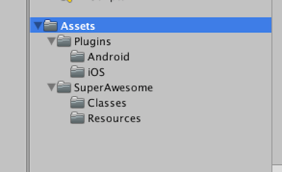

Add the SDK
===========

The Unity Publisher SDK is built as an an Unity Package in order to work together with the Android and iOS native SDKs
so that you can harness the full power of native components, such as video based on AVFoundation / VideoView technology,
proper WebViews and a better fullscreen experience.

To begin integrating the SDK:

1) Download the latest full Unity Publisher SDK: `SuperAwesomeSDK-<sdk_version>.Unity.full.unitypackage <https://github.com/SuperAwesomeLTD/sa-sdk-build-repo/blob/master/package/aa_unity/<sdk_version>/SuperAwesomeSDK-<sdk_version>.Unity.full.unitypackage?raw=true>`_.
The **full** version will contain everything you need in order to load and display banner, interstitial and video ads as well as the 3rd party `Moat Analytics <https://moat.com/analytics>`_ module.

2) Download the latest base Unity Publisher SDK: `SuperAwesomeSDK-<sdk_version>.Unity.base.unitypackage <https://github.com/SuperAwesomeLTD/sa-sdk-build-repo/blob/master/package/aa_unity/<sdk_version>/SuperAwesomeSDK-<sdk_version>.Unity.base.unitypackage?raw=true>`_.
This has the same functionality as the full version, but lacks the Moat Analytics module.

Either download you choose, you can then import it into your Unity project as a custom assets package.

You should see an image similar to this:

.. image:: img/IMG_02_Import.png

Select all the files, and click Import.
If all goes well you should have a series of new folders and files in your Assets directory.

Once you've integrated the SuperAwesome SDK, you can access it by:

.. code-block:: c#

    using SuperAwesome

.. warning:: When exporting for iOS as an XCode project, you'll need to add the following flag to **Other linker flags** in **Build Settings**: -ObjC

.. warning:: When exporting for Android as an Android Studio project you'll need to set the **unityplayer.ForwardNativeEventsToDalvik** entry to **true**

.. code-block:: xml

    <meta-data android:name="unityplayer.ForwardNativeEventsToDalvik" android:value="true" />
