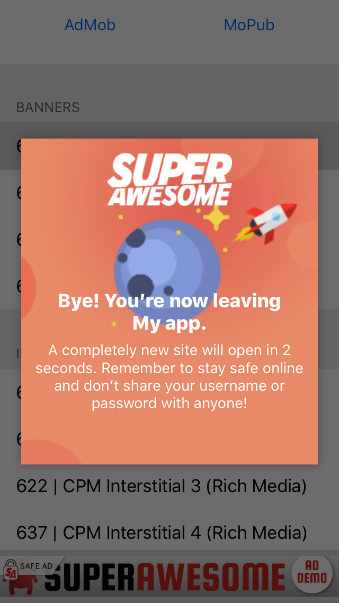

Bumper page
===========

The Bumper page is an optional UI element you can add to your ad placements so that when a user clicks on an ad he is
presented with a popup informing him he's about to leave the app and open the native browser. The popup will disappear after
a three second countdown.

You can enable it like so:

.. code-block:: c#

  //
  // enable Bumper page on one banner placement
  mybanner.enableBumperPage();

  //
  // enable Bumper page on all interstitial ads
  SAInterstitialAd.enableBumperPage();

  //
  // enable Bumper page on all video ads
  SAVideoAd.enableBumperPage();

  //
  // enable Bumper page on all app wall ads
  SAAppWall.enableBumperPage();

The final result will look something similar to this:

These are the default values:

=========== ========
Parameter   Value
=========== ========
Bumper page Disabled
=========== ========

You can also customize the general appearance of the Bumper Page by calling:

.. code-block:: c#

  //
  // customize the name displayed on the bumper page
  SABumperPage.overrideName("__CUSTOM_APP_NAME__");

By default the Bumper page will try to use the application name and the AwesomeAds logo.
