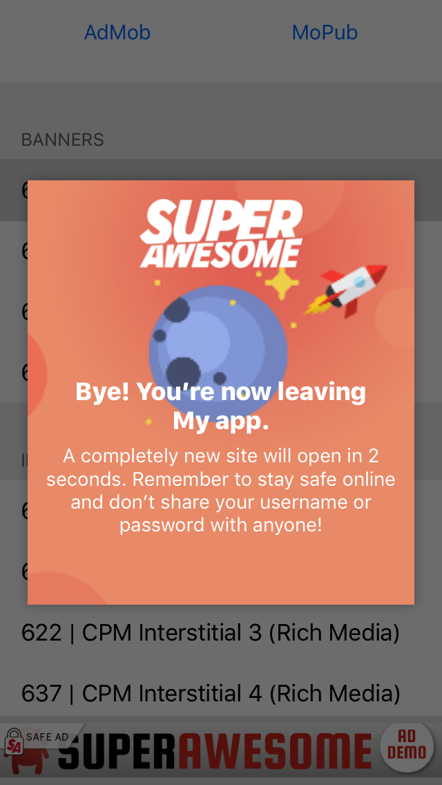

Bumper page
===========

This section will show how to use the bumper element and how to customise it.

The Bumper is an optional UI dialog that informs the user that they are about to leave a kid-safe place and proceed to an external website.

In technical terms when a user clicks on an ad placement a bumper popup will be presented for a duration of 3 seconds informing that the user will be redirected to a external source.

SuperAwesome’s kid-safe review team will always configure the bumper when:

 * An ad links to a social media site, eg YouTube, Facebook, etc.
 * An ad links to a retailer or online shop

Bumper customisation
--------------------

You can customise the general appearance of the Bumper Page by calling:

.. code-block:: c#

  //
  // customize the name displayed on the bumper page
  SABumperPage.overrideName("__CUSTOM_APP_NAME__");

By default the Bumper page will try to use the application name and the AwesomeAds logo and will look like following:

Forcing the bumper
------------------

Optionally, Publishers can choose for the bumper to always display when an ad is served on a placement. In order to enable the bumper, please use the following code:

.. code-block:: c#

  //
  // enable Bumper page on one banner placement
  mybanner.enableBumperPage();

  //
  // enable Bumper page on all interstitial ads
  SAInterstitialAd.enableBumperPage();

  //
  // enable Bumper page on all video ads
  SAVideoAd.enableBumperPage();
