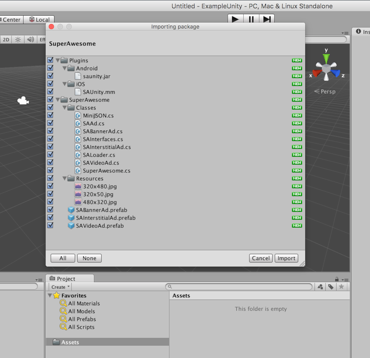
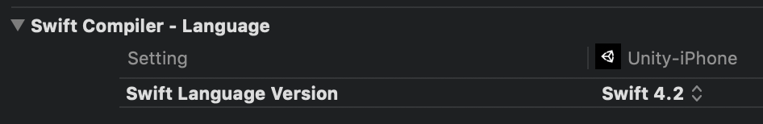
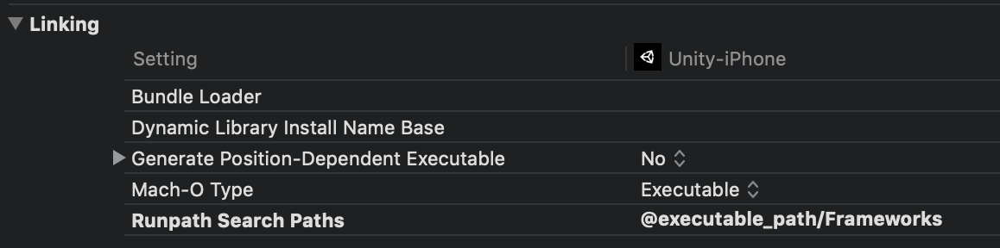
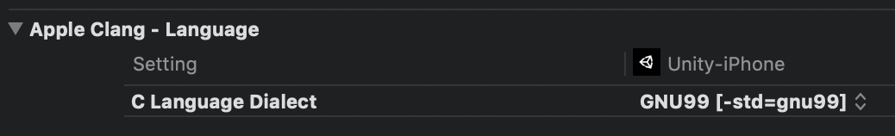
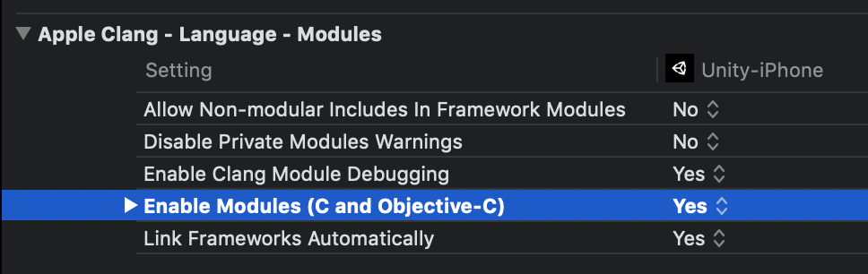
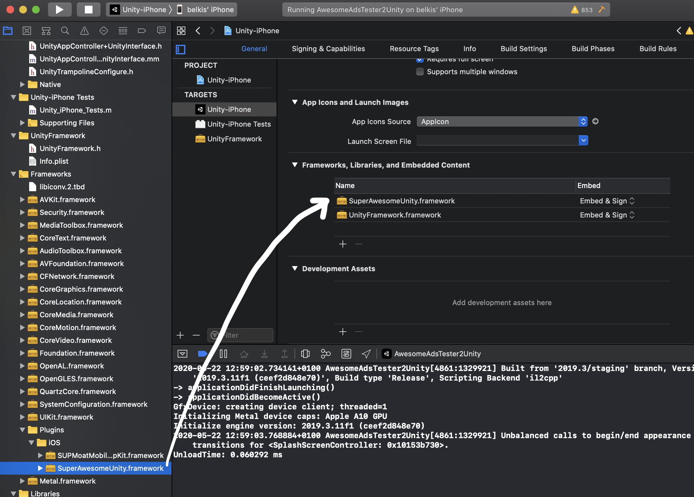

Add the SDK
===========

The Unity Publisher SDK is built as an an Unity Package in order to work together with the Android and iOS native SDKs
so that you can harness the full power of native components, such as video based on AVFoundation / VideoView technology,
proper WebViews and a better fullscreen experience.

To begin integrating the SDK:

Download the latest Unity Publisher SDK: `SuperAwesomeSDK-<sdk_version>.Unity.full.unitypackage <https://github.com/SuperAwesomeLTD/sa-sdk-build-repo/blob/master/package/aa_unity/SuperAwesomeSDK-<sdk_version>.Unity.full.unitypackage?raw=true>`_.

This version will contain everything you need in order to load and display banner, interstitial and video ads.

You can then import it into your Unity project as a custom assets package. You should see an image similar to this:

Select all the files, and click Import.
If all goes well you should have a series of new folders and files in your Assets directory.

.. image:: img/IMG_03_Assets.png

Once you've integrated the SuperAwesome SDK, you can access it by:

.. code-block:: c#

    using tv.superawesome.sdk.publisher;

Additional steps for Android builds
-----------------------------------

.. warning:: Please remember that for Android you also need to add **Google Play Services** and an **App Compat** library. These are needed for correct viewability metrics.

.. code-block:: shell

    dependencies {
        implementation 'com.android.support:appcompat-v7:+'
        implementation 'com.google.android.gms:play-services-ads:+'
    }

.. warning:: When exporting for Android as an Android Studio project you'll need to set the **unityplayer.ForwardNativeEventsToDalvik** entry to **true**

.. code-block:: xml

    <meta-data android:name="unityplayer.ForwardNativeEventsToDalvik" android:value="true" />

Additional steps for iOS builds
-------------------------------

Set swift version to **4.2**, if not already set

Add runpaths **@executable_path/Frameworks** to runpaths

Set C lang dialect to **gnu99**, if not already set

Enable modules (C and Obj-C), if not already enabled

For Unity 2019, make sure you explicitly add the **SuperAwesomeUnity.framework** in the **Frameworks, Libraries & Embedde Content** section of XCode.

